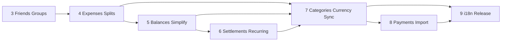

# SplitEase Feature Roadmap

Product feature list mapped onto development phases. Implement only the **current** incomplete phase (see [PROGRESS.md](../PROGRESS.md)); do not skip ahead.

## Feature-to-phase matrix

| Feature                             | Phase                                                    | Status      |
| ----------------------------------- | -------------------------------------------------------- | ----------- |
| Add groups and friends              | **3** — Friends & Groups                                 | Done        |
| Split expenses, record debts        | **4** — Expense Creation & Splitting                     | Done        |
| Equal or unequal splits             | **4**                                                    | Done        |
| Split by % or shares                | **4**                                                    | Done        |
| Unlimited expenses                  | **4** (+ product rule thereafter)                        | Done        |
| Calculate total balances            | **5** — Balances & Debt Simplification                   | Done        |
| Simplify debts                      | **5**                                                    | Done        |
| Recurring expenses                  | **6** — Settlements & Recurring Expenses                 | Done        |
| Manual settlements / mark paid      | **6**                                                    | Done        |
| Offline mode (hardened)             | **7** — Search, Categories, Multi-Currency, Offline Sync | Done        |
| Cloud sync (full queue + conflicts) | **7**                                                    | Done²       |
| Spending totals                     | **7**                                                    | Done        |
| Categorize expenses                 | **7**                                                    | Done        |
| 100+ currencies                     | **7**                                                    | Done        |
| Payment integrations                | **8** — Stretch / Pro-like Features                      | Done        |
| Transaction import                  | **8**                                                    | Done        |
| 7+ languages                        | **9** — Polish, Testing, and Release Prep                | Not started |

¹ Room offline-first cache exists from Phase 1; friends/groups already write locally first. Phase 7 adds a durable sync queue, conflict policy, and reliable offline UX for expenses/balances.  
² Friends/groups already sync best-effort via PostgREST (Phase 3). Phase 7 extends this to expenses, balances, settlements, and recurring rows with retry/conflict handling.

## Phase summaries

### Phase 0 — Project Setup, Foundations & Brand Theme *(done)*
Gradle, Compose Material 3, Hilt, Welcome screen, indigo/amber brand ColorScheme + design tokens. No product features yet.

### Phase 1 — Data Layer Foundations *(done)*
Room schema, repositories, `BigDecimal` money, sync bookmarks. Enables offline later; no UI for expenses yet.

### Phase 2 — Authentication (Supabase) *(done)*
Sign-up / sign-in / session gating. Prerequisite for cloud identity.

### Phase 3 — Friends & Groups *(done)*
**Covers:** Add groups and friends  
Friend list, groups, members, invites, Room + Supabase sync for social graph.

### Phase 4 — Expense Creation & Splitting Logic *(done)*
**Covers:** Split expenses, record debts · Equal / unequal · Split by % or shares · Unlimited expenses  

| In                                                           | Out                                     |
| ------------------------------------------------------------ | --------------------------------------- |
| Create/edit/delete expenses in a group (or 1:1)              | Balance dashboard (Phase 5)             |
| Payer + participants                                         | Debt simplification graph (Phase 5)     |
| Split modes: equal, unequal amounts, by %, by shares         | Recurring (Phase 6)                     |
| Persist splits with `BigDecimal` rounding rules + unit tests | Categories UI beyond defaults (Phase 7) |
| No artificial cap on expense count                           | Payment apps / CSV import (Phase 8)     |

### Phase 5 — Balances & Debt Simplification *(done)*
**Covers:** Calculate total balances · Simplify debts  

| In                                                  | Out                         |
| --------------------------------------------------- | --------------------------- |
| Per-friend and per-group net balances from expenses | Settlements UI (Phase 6)    |
| "Who owes whom" lists                               | Recurring (Phase 6)         |
| Debt simplification (minimize transactions)         | Multi-currency FX (Phase 7) |

### Phase 6 — Settlements & Recurring Expenses *(done)*
**Covers:** Recurring expenses · record / settle debts  

| In                                                   | Out                                  |
| ---------------------------------------------------- | ------------------------------------ |
| Mark settlement / "record payment" between users     | Hardened offline queue (Phase 7)     |
| Recurring expense templates + schedule (WorkManager) | Payment gateway deep links (Phase 8) |
| Generated instances feed Phase 4 expense model       |                                      |

### Phase 7 — Search, Categories, Multi-Currency, Offline Sync *(done)*
**Covers:** Offline mode · Cloud sync · Spending totals · Categorize expenses · 100+ currencies  

| In                                                              | Out                                       |
| --------------------------------------------------------------- | ----------------------------------------- |
| Expense search; category pickers + custom categories            | i18n strings pack (Phase 9)               |
| Spending totals by category / period (list + simple aggregates) | Rich charts (Phase 8 / Vico)              |
| Currency catalog (100+), per-expense/group currency display     | Live FX rates may be stubbed then refined |
| Durable offline write queue, pull sync, conflict policy         | Payment integrations (Phase 8)            |

### Phase 8 — Stretch / Pro-like Features *(done)*
**Covers:** Payment integrations · Transaction import  

| In                                                                  | Out                                    |
| ------------------------------------------------------------------- | -------------------------------------- |
| Deep links / share to UPI, PayPal, Venmo-style "pay" (region-aware) | Full banking Open Banking (out of MVP) |
| Import transactions (CSV / statement parse)                         | Store listing assets (Phase 9)         |
| Vico charts for spending totals enhancement                         |                                        |

### Phase 9 — Polish, Testing, and Release Prep *(done)*
**Covers:** 7+ languages  

| In                                              | Out                                                                                                                                                       |
| ----------------------------------------------- | --------------------------------------------------------------------------------------------------------------------------------------------------------- |
| `values-xx` string resources for 7+ locales     | New core product features                                                                                                                                 |
| Instrumentation + regression, release checklist |                                                                                                                                                           |
| Email confirmation / production Auth hardening  | Signup OTP verify in-app ([maintenance-email-otp-verification.md](maintenance-email-otp-verification.md)); dashboard template must include `{{ .Token }}` |
| Real Room migrations; store listing prep        |                                                                                                                                                           |

## Post-phase extras

Features shipped or requested after Phase 9. Track in:

- [phase-10-expense-details-onboarding-invite-mail.md](./phase-10-expense-details-onboarding-invite-mail.md) — expense details + Activity, onboarding, invite deep-link join, welcome mail
- [phase-11-group-pin-board.md](./phase-11-group-pin-board.md) — group pin board
- [phase-12-forgot-password-email-otp.md](./phase-12-forgot-password-email-otp.md) — recovery OTP
- [extras-group-live-updates-notifications.md](./extras-group-live-updates-notifications.md) — notify group members on expense/payment changes; open group > latest cloud entries
- **TODO(auth-mobile-onboarding)** — onboard with mobile phone number (SMS OTP / phone auth) in addition to email ([PROGRESS.md](../PROGRESS.md))
- **OTP operations** — keep signup/recovery OTP delivery healthy (SMTP/provider + templates with `{{ .Token }}`)

## Dependency order

## Product notes

- **Unlimited expenses** is a product rule (no freemium cap), enforced from Phase 4 onward—not a separate backend product.
- **Offline mode** and **cloud sync** are progressive: local-first from Phase 1, social sync in Phase 3, full expense/balance sync + queue in Phase 7.
- Do not start a phase until the prior phase doc has a complete **Outcome** section.
